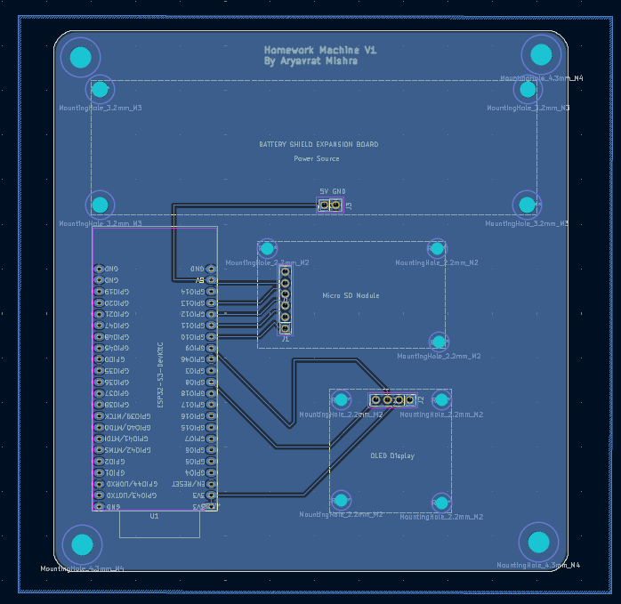
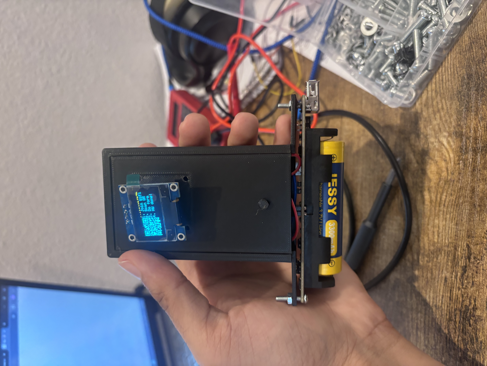
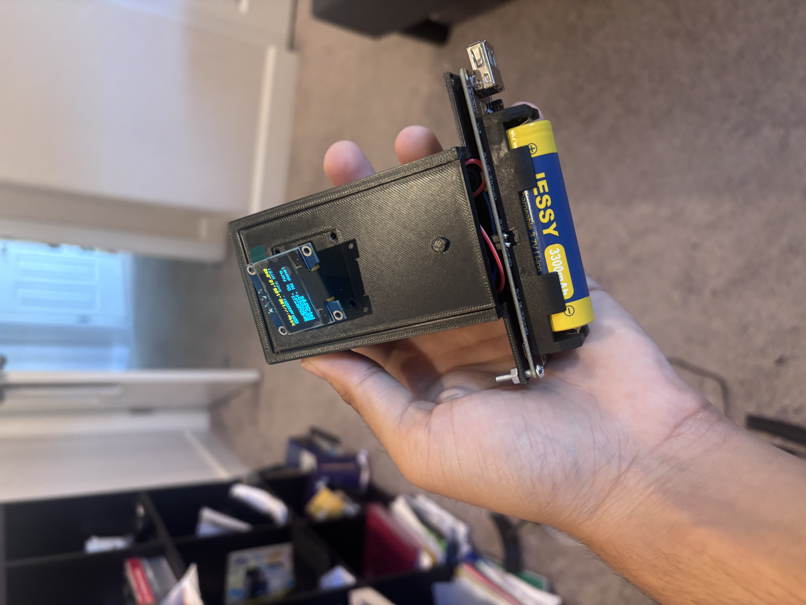
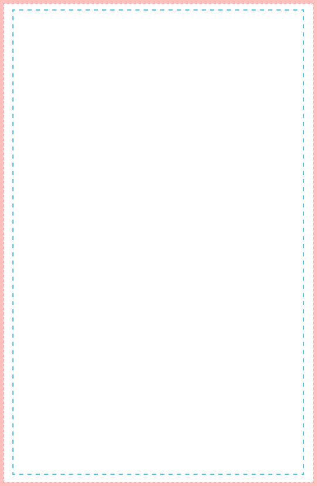

<!--  -->

    <h1>
        av's homework machine
    </h1>
    

        <strong>
            i hate doing homework, so i spent 40 hours avoiding it
        </strong>
    

    

        <a href="#features">Features</a> •
        <a href="#demo">Demo</a> •
        <a href="#pcb">PCB</a> •
        <a href="#cad-files">CAD</a> •
        <a href="#building--flashing-firmware">Firmware</a> •
        <a href="#usage">Usage</a>
    

    
    

## What is this?

This machine does your homework! Well... there's a little bit more to it than that. First, it takes your handwriting and runs a custom Font Engine. So, once you give it your homework, it formulates a response, and then generates GCode and uploads it onto an SD Card. When this GCode is run on a 3d printer with a pen attachment, it will look exactly like you wrote it!

## How do you use it?

I designed this with an Ender 3 3d Printer in mind, since that's what I had. All you need is:
- SD Card
- A 3D Printer/Pen Plotter
- Some paper and a pen
And that's really it. There are some very cheap options out there, so anything you find will be fine!

## Why did you make this?

When I was in 3rd grade, I read a book called [The Homework Machine by Dan Gutman](https://www.goodreads.com/book/show/977597.The_Homework_Machine). Now, the moral of the story was that you should do your own homework. However, 9-year-old me didn't catch that deeper meaning, and instead thought: 

> woah i want a machine that does my homework :O

After Google failed to find me one, the idea became dormant for several years. Until like 2-3 months ago, I realized that my Ender 3 printer, which I bought for like $50, functioned exactly like a pen plotter! So, I spent a lot of time coding a font engine that can create GCode that looks exactly like your handwriting. Then, I crammed together a bunch of electronics to make a machine that automates a long pipeline to do your homework easy peasy!

## Features

- ESP32-powered
  - Configure settings via the webserver
  - Very Fast
- .96 inch display
- Battery Powered
- Rechargable
- Small size

Here's how it looks:        

## Demo

I'm working on making a demo, give me a sec...

## PCB

Images of schematics and PCB design are all under the [PCB folder](pcb/). I had a PCB ready and designed for this, but it came on June 20th, so I didn't create a CAD for it. It's better to use the individual components and a breadboard.

## CAD files

CAD files are under [`CAD/`](CAD/). I made this entirely in Fusion 360. I found models of all the electrical parts and rescaled them to match my actual parts, so the CAD isn't entirely accurate to real life!

## Building + flashing firmware

To build and flash the firmware, I used ArduinoIDE. I'm sure there's a way to use PlatformIO, but it'll probably be less straightforward. Go to ['Firmware'](firmware/) and send the [Webserver.ino](firmware/Webserver.ino) file to the ESP32. Then, in ArduinoIDE, press Ctrl+Shift+P and type "Upload LittleFS to Pico/ESP8266/ESP32", which will send everything from the [data folder](firmware/data/) to the microcontroller! 

## Usage

Everything is handled when you first launch. It'll turn into an Access Point, and you can connect directly to it and type in your WiFi credentials. After that, you can visit `"http://<IP>/settings"` to change anything, or visit the IP directly to use. All you need to do is upload your homework, press 3 buttons, and you're good to go! In data, it comes preinstalled with my handwriting, so you might want to change that.

## Magazine page

Check it out!!

